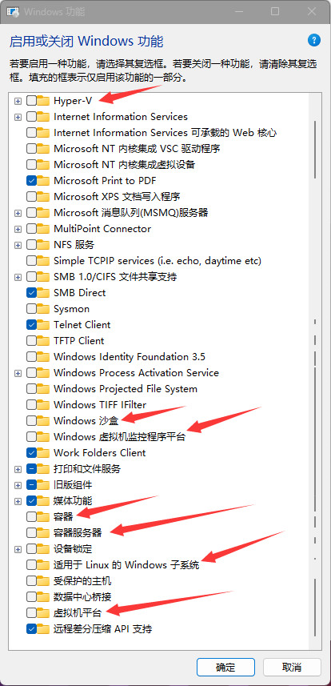
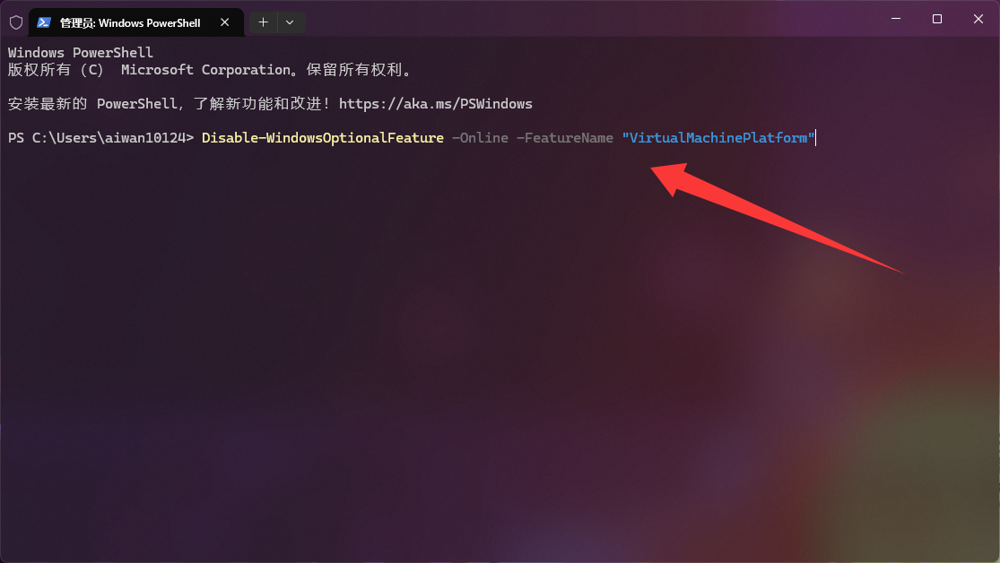
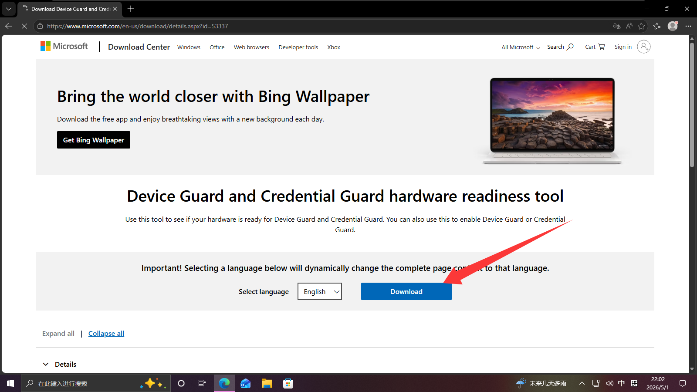
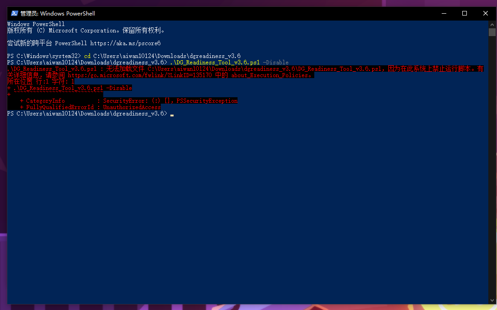
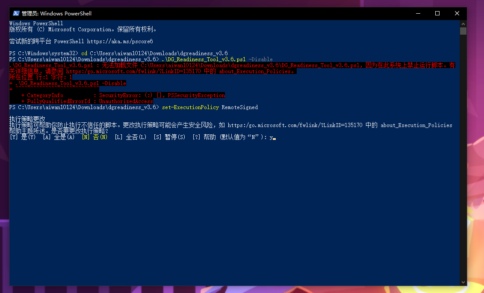
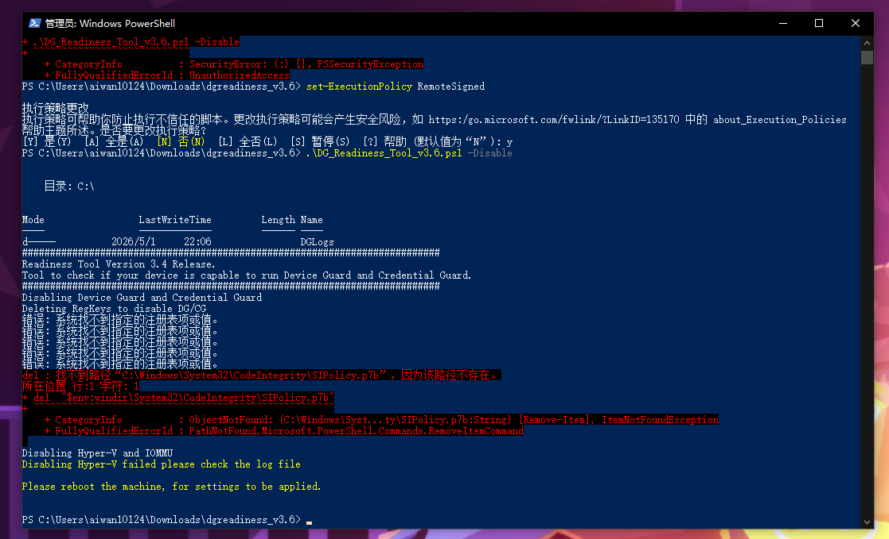
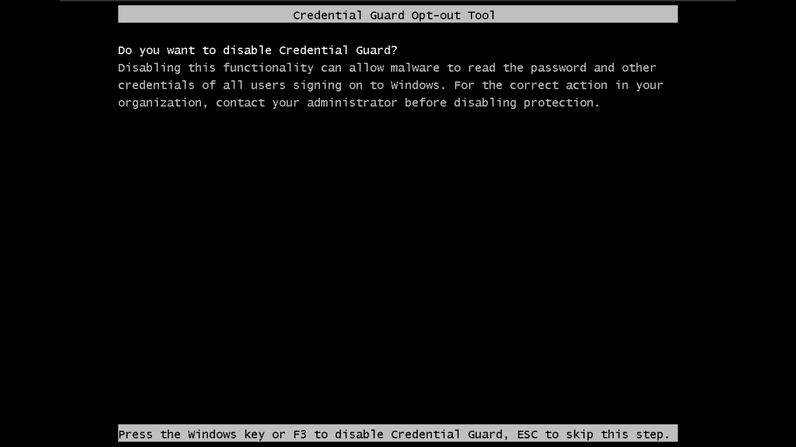
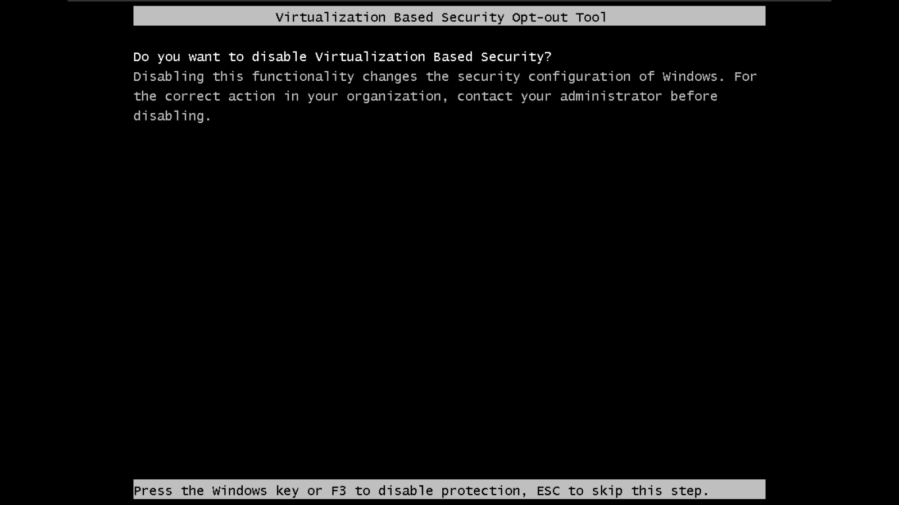

视频教程：[b站链接](https://www.bilibili.com/video/BV1bUGnzWETL)

<iframe src="//player.bilibili.com/player.html?isOutside=true&aid=114818249916742&bvid=BV1bUGnzWETL&cid=30925325750&p=1" scrolling="no" border="0" frameborder="no" framespacing="0" allowfullscreen="true" width="100%" height="468"></iframe>

# 1.关闭相关hyper-V功能



关闭1.Hyper-V 2.Windows沙盒 3.Windows虚拟机监控程序平台 4.容器 5.容器服务器 6.适用于Linux的windows子系统 7.虚拟机平台

如果没有虚拟机平台的选项就右键开始菜单管理员运行powershell或者终端，输入一下这条命令。

```powershell
Disable-WindowsOptionalFeature -Online -FeatureName "VirtualMachinePlatform"
```



重启即可。

# 2.关闭内存完整性

1.打开链接下载文件

[下载链接](https://www.microsoft.com/en-us/download/details.aspx?id=53337)



2.用管理员身份打开powershell然后cd到刚才下载后解压好的文件夹，然后输入

```powershell
.\DG_Readiness_Tool_v3.6.ps1 -Disable
```

3.如果提示如图报错。



输入以下命令

```powershell
set-ExecutionPolicy RemoteSigned
```



输入y即可

4.然后重复输入即可。



执行完就可以重启了

5.重启之后做的操作

遇到这个界面按F3即可



然后又会来到这个界面，还是按F3



然后电脑会黑屏，按回车键就能开机。然后你就能使用你的vmware了
